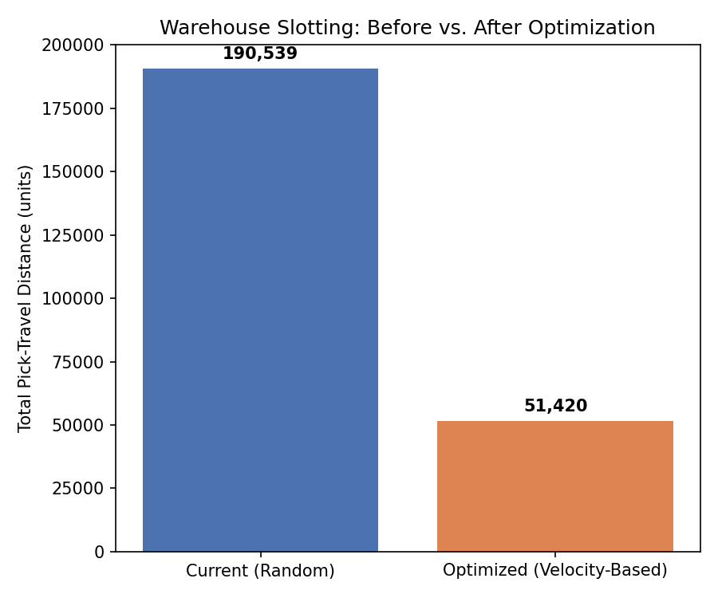
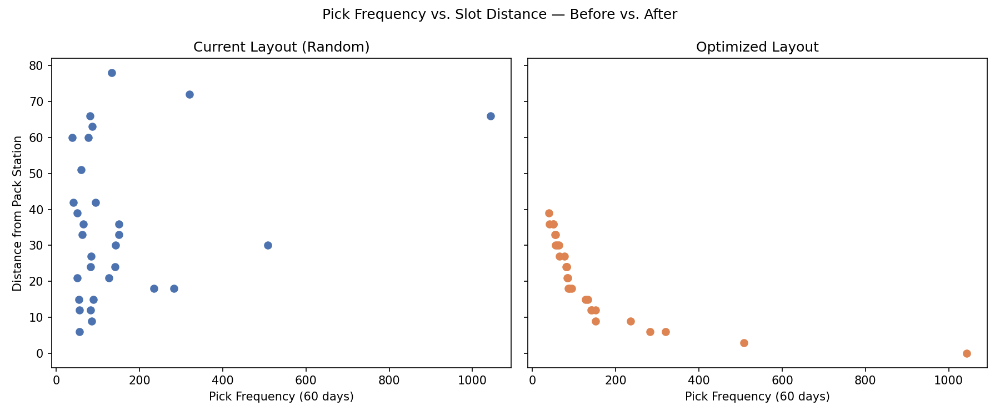

# Warehouse Slotting & Pick-Path Optimization

A Python/pandas model that re-slots a 30-product warehouse catalog by pick velocity, replacing an unoptimized (random) layout with one where fast-moving products sit closest to the pack station — cutting the total distance pickers travel to fulfill orders.

## What it does

- **Baseline measurement** — merges 60 days of per-product pick-frequency data with a 60-slot warehouse layout (6 aisles × 5 bays × 2 levels, each with a distance from the pack station) to calculate the total pick-travel distance under the current, randomly-assigned layout.
- **ABC / Pareto classification** — ranks all 30 products by pick frequency and classifies them into velocity tiers: the 15 products driving the first 80% of picking activity (A), the next 10 driving 15% more (B), and the remaining 5 slow movers (C).
- **Velocity-based slotting optimization** — reassigns products to warehouse slots by pairing the busiest movers with the closest slots (and slowest movers with the farthest), using the rearrangement-inequality principle that this pairing minimizes total weighted distance.
- **Before/after quantification** — recalculates total pick-travel distance under the optimized layout and measures the reduction.

## Result

Total modeled pick-travel distance dropped from **190,539** to **51,420** — a **~73% reduction**, comparing a fully random baseline layout to a fully velocity-optimized one. The scatter plot above shows why: before optimization, pick frequency and slot distance are uncorrelated (fast and slow movers scattered at random distances); after optimization, they're tightly and inversely related — the busier a product, the closer it sits to the pack station.

*Note on the result: this compares two extremes — an unoptimized baseline and a fully optimized layout — so it represents the theoretical ceiling of this approach. A real warehouse would likely capture a meaningful portion of this gain rather than the full amount, due to practical constraints like phased re-slotting, product size/weight limits, and operational disruption during the move. The exercise is meant to demonstrate the scale of value that ABC-based slotting can unlock, not to claim a guaranteed real-world figure.*

## Tools

Python (pandas for data merging and analysis, matplotlib for visualization), Google Colab / Jupyter Notebook.

## About the data

Uses the same 30-product catalog as my [Inventory Forecasting & Reorder-Point Dashboard](../inventory-forecasting-dashboard) project, applied to a different operational question — physical warehouse layout rather than replenishment timing. Pick-frequency data and the warehouse layout are synthetic, built to reflect a realistic Pareto distribution of product velocity and a representative multi-aisle, multi-level warehouse structure.

## Files

| File | Description |
|---|---|
| `warehouse_slotting_optimization.ipynb` | The full analysis notebook — data loading, ABC classification, optimization, and charts |
| `SKU_Pick_Data.csv` | Source data: pick frequency and current slot per product |
| `Warehouse_Slots.csv` | Warehouse layout: 60 slots with distance from the pack station |
| `before_after_travel_distance.png` | Bar chart comparing total travel distance before/after |
| `scatter_before_after.png` | Scatter plot showing pick frequency vs. slot distance, before/after |

## Author

Mohamed Seddik Nakbi
[linkedin.com/in/mohamed-seddik-nakbi-74640035b](https://linkedin.com/in/mohamed-seddik-nakbi-74640035b)
